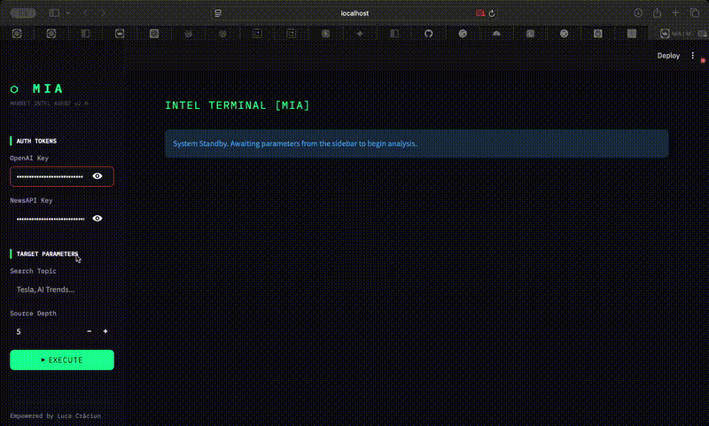

# 📊 Market Intelligence Agent — Automated Research Pipeline

An autonomous AI agent that **scrapes full-text market news, analyzes it with GPT-4o, and outputs structured business intelligence** — risk scores, sentiment signals, and executive summaries — in under 30 seconds.

> Built because most market research tools analyze headlines, not content. This one reads the full article.

---

## 🎬 Demo

<p align="center">
  
</p>

---

## 🧠 How It Works

```
NewsAPI → Full Article Scrape (newspaper3k) → GPT-4o Structured Analysis
                                                          ↓
                               JSON Output + Excel Report (openpyxl)
```

**The pipeline:**
1. Fetches recent news articles via NewsAPI for a given topic/ticker
2. Scrapes full article body using `newspaper3k` (not just headlines)
3. Sends full text to GPT-4o in JSON mode for structured extraction
4. Generates per-article intelligence: sentiment, risk factors, strategic outlook
5. Exports results to Excel (for stakeholders) and JSON (for integrations)

---

## ⚙️ Key Design Decisions

- **Why full-text scraping instead of headlines?** Headlines are optimized for clicks, not accuracy. GPT-4o reasoning is only as good as its input — shallow input = shallow analysis.
- **Why GPT-4o JSON mode?** Structured outputs guarantee consistent data schema across articles. This makes downstream automation (pipelines, dashboards) reliable and not dependent on prompt engineering tricks.
- **Why dual output (Excel + JSON)?** Two different user types: business stakeholders want readable Excel reports, engineers want raw JSON for integrations. Both are generated from the same run.
- **Why `newspaper3k` for scraping?** Handles boilerplate removal, encoding issues, and multi-source extraction cleanly — more robust than raw `requests` + `BeautifulSoup` for news content.

---

## 📊 Output Data Model

Each processed article generates:

| Field | Description |
|---|---|
| `market_sentiment` | Bullish / Bearish / Neutral |
| `credibility_score` | 1–10, based on source depth and specificity |
| `risk_factors` | List of extracted threats and downside scenarios |
| `strategic_outlook` | Long-term implications and trend signals |
| `executive_summary` | 3–5 sentence decision-ready brief |

---

## 📈 Results

Tested on 200+ articles across tech, finance, and macro news:

- ~90% reduction in research time (hours → under 30 seconds)
- Consistent structured output across diverse news sources
- Dual export enables direct integration into reporting pipelines

---

## 🛠️ Tech Stack

- **Python 3.12**
- **OpenAI API** — GPT-4o with JSON structured outputs
- **NewsAPI** — article discovery and metadata
- **newspaper3k** — full-text article extraction
- **pandas** — data processing and transformation
- **openpyxl** — Excel report generation
- **requests** — API communication

---

## ▶️ Getting Started

```bash
git clone https://github.com/lucaomul/market-intelligence-agent.git
cd market-intelligence-agent
pip install openai requests pandas openpyxl newspaper3k lxml_html_clean
```

Create a `.env` file (see `.env.example`):

```env
OPENAI_API_KEY=your_key_here
NEWS_API_KEY=your_key_here
```

Run:

```bash
python market_intelligence.py
```

---

## 📁 Project Structure

```
market-intelligence-agent/
├── market_intelligence.py  # Full pipeline: scraping, analysis, export
└── requirements.txt
```

---

## 🧪 Use Cases

**Investment Research** — Monitor sentiment shifts on a stock or sector before making decisions.

**Competitive Intelligence** — Track what's being written about competitors and extract strategic signals.

**Risk Monitoring** — Automatically flag negative sentiment and risk factors across a topic in real time.

**Newsletter Generation** — Transform raw news into structured summaries ready for distribution.

---

## 🔮 What's Next

- Real-time streaming pipeline (event-driven instead of batch)
- Multi-source aggregation beyond NewsAPI (RSS feeds, Reddit, SEC filings)
- Historical trend analysis and time-series sentiment tracking
- Streamlit dashboard for interactive querying
- Evaluation benchmark vs manual analyst workflows

---

## 👤 Author

**Luca Craciun** — AI Automation Engineer  
[GitHub](https://github.com/lucaomul) · [LinkedIn](https://www.linkedin.com/in/gabriel-luca-craciun-25ba95295)
